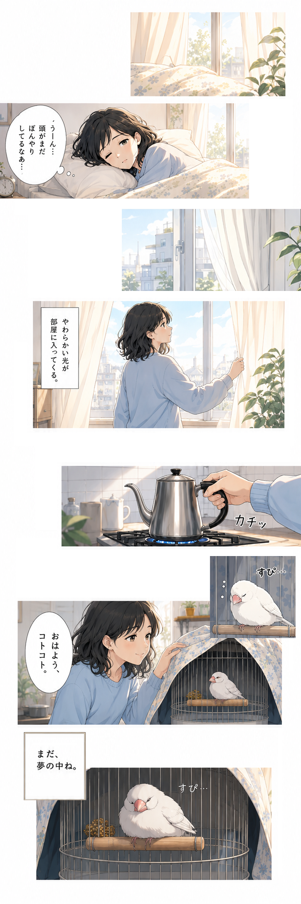

# Vertical Scroll Comic CMS

A lightweight open-source PHP + SQLite CMS and reader for creator-owned vertical-scroll comics.

## Screenshot



## Requirements

- PHP 8.2+
- SQLite support through the PHP PDO SQLite extension

No Composer dependencies are required for the MVP.

## Quick Start

```bash
cp config/config.example.php config/config.php
php scripts/create_password_hash.php "your-password"
```

Paste the generated hash into `config/config.php` as `admin_password_hash`.

Then initialize the database and start the local server:

```bash
php scripts/init_db.php
php -S localhost:8000 -t public
```

Open:

- Public site: http://localhost:8000/
- Admin: http://localhost:8000/admin/

The default admin username in `config/config.example.php` is `admin`.

## Admin Workflow

1. Log in to `/admin/`.
2. Create a series.
3. Create an episode under that series.
4. Upload comic panel images from the episode block editor.
5. Add spacer or text blocks as needed.
6. Move blocks up/down until the reading rhythm feels right.
7. Publish the episode and series.
8. Open the public reader.

## Public Viewer

The public side includes:

- Home page with published series.
- Series page with published episodes.
- Reader page with vertically ordered image, spacer, and text blocks.
- Previous and next episode links.

Draft series and draft episodes are hidden from public pages.

## Security Notes

This MVP is intended for local development and small self-hosted experiments. Review security settings before exposing the admin area publicly.

Current safeguards include:

- Single-user password login with `password_hash()` / `password_verify()`.
- PHP sessions.
- CSRF tokens for admin POST actions.
- PDO prepared statements.
- HTML escaping for user-provided text.
- Upload validation for JPEG, PNG, WebP, and GIF files.

Do not commit `config/config.php`, `data/app.sqlite`, or uploaded production images.

## Upload Limits

The app setting `upload_max_bytes` is capped by PHP's own limits. On a default Homebrew PHP install, `upload_max_filesize` may be `2M`, so larger comic panels will be rejected until PHP is configured with larger values.

Check your active limits:

```bash
php -i | grep -E "upload_max_filesize|post_max_size|file_uploads"
```

For rental hosting such as Xserver, confirm that these are enabled before uploading:

- PHP 8.2 or newer.
- PDO SQLite / SQLite3 extension.
- File uploads enabled.
- `upload_max_filesize` large enough for one panel image.
- `post_max_size` large enough for all selected images in one upload request.
- Write permission for `data/` and `public/uploads/`.

## Manual Test Checklist

- [ ] `php scripts/init_db.php` creates the SQLite database.
- [ ] `php -S localhost:8000 -t public` starts the app.
- [ ] Public home loads.
- [ ] Admin login rejects invalid credentials.
- [ ] Admin login accepts the configured username/password.
- [ ] A series can be created and published.
- [ ] An episode can be created and published.
- [ ] At least three panel images can be uploaded.
- [ ] Blocks can be moved up and down.
- [ ] Spacer and text blocks can be added.
- [ ] Published episode appears in the public reader.
- [ ] Draft content is hidden publicly.
- [ ] `php -l` passes on all PHP files.

## Roadmap

- Drag-and-drop reordering.
- Cover image selection.
- Bulk upload ordering by filename.
- Better mobile admin layout.
- Static HTML export.
- Optional RSS feed.

## License

MIT
